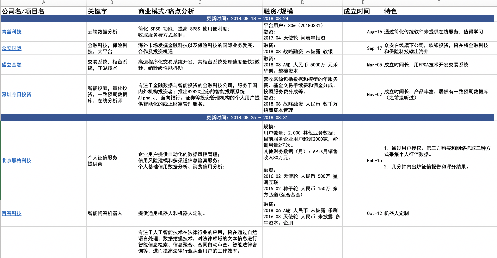

# Awesome-FinTech
Everything about FinTech: companies, technologies, libraries & packages, policies, jobs, milestones ...

## Resources

- [金融科技企业数据库](http://www.fintechdb.cn/)
- [铅笔道-精选项目](https://www.pencilnews.cn/projectlist)
- [36kr-鲸准-创业项目资金对接信息平台（需账号认证）](https://rong.36kr.com/)

## Companies

For latest list, please check the excel file: [FinTech-Firms.xlsx](./FinTech-Firms.xlsx)

## Policies
- [北京市促进金融科技发展规划（2018年-2022年）](http://www.01caijing.com/blog/329438.htm)

## Libraries & Packages

- [zipline](https://github.com/quantopian/zipline)
- [tushare](https://github.com/waditu/tushare)
- [vnpy](https://github.com/vnpy/vnpy)
- [stanfordnlp](https://github.com/stanfordnlp/stanfordnlp)

## Charts

* [highcharts](https://www.highcharts.com/)
* [highstock](https://www.highcharts.com/blog/products/highstock/)
* [TradingView](https://www.tradingview.com/HTML5-stock-forex-bitcoin-charting-library/) 
* [pyfolio](https://github.com/quantopian/pyfolio) 

## Jobs

